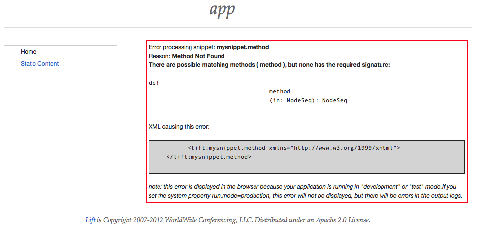

# Liftweb Null Snippet

Short example project displaying unexpected behavior in [Lift 3.0](liftweb.net).

## What I did

    $ git clone https://github.com/aweinert/liftweb-null-snippet
	<...snip...>
	$ cd liftweb-null-snippet
	$ ./sbt
	> container:start
	<...snip...>

Then, open a browser and navigate to `127.0.0.1:8080`

## What happened

An error is displayed, as shown here: 

## What I expected to happen

An error should indeed be displayed, but I think the error message is somewhat misleading.
While it is probably technically correct, it should point to a null-pointer-issue rather than to a method resolution one.
